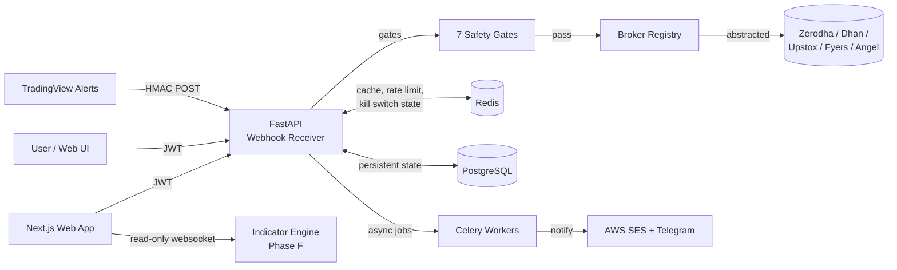

# Architecture Overview

This document is the high-level map for new contributors. For deep-dive specifics see [architecture.md](architecture.md). This guide is the 15-minute orientation.

## System at a glance



## Component responsibilities

### Backend (FastAPI, Python 3.11+)

- **API layer** (`backend/app/api/`) — HTTP endpoints, request validation, auth checks.
- **Services** (`backend/app/services/`) — business logic, brokers, kill switch, notifications.
- **Brokers** (`backend/app/brokers/`) — one file per broker, implements `BrokerInterface`.
- **Database** (`backend/app/db/`) — SQLAlchemy 2.0 models, Alembic migrations, 12-table schema.
- **Middleware** (`backend/app/middleware/`) — security headers, rate limiting, request IDs.
- **Tasks** (`backend/app/tasks/`) — Celery scheduled jobs (session token rotation, daily P&L roll-ups).
- **Phase F indicator engine** (`backend/app/indicators/`) — Glass Box auditable calculations.

### Frontend (Next.js 16 App Router, React 19)

- **Routes** (`frontend/src/app/`) — App Router pages, including auth, dashboard, strategies, charts.
- **Components** (`frontend/src/components/`) — reusable UI primitives.
- **Lib** (`frontend/src/lib/`) — strategy templates, indicators, marketing, help/FAQ, email templates.
- **Tests** (`frontend/tests/`) — Vitest unit + integration.

### Infrastructure

- **PostgreSQL 16** — primary database. 12 tables for users, brokers, strategies, trades, audit.
- **Redis 7** — rate limiting, kill switch state, P&L counters, session cache.
- **AWS EC2 + RDS + ElastiCache** — production hosting. Vercel for the frontend.
- **AWS SES** — transactional email.
- **Telegram Bot API** — alternate notification channel.

## Critical data flows

### 1. TradingView alert → live order

```
TradingView Alert
   │ POST /api/webhook/tradingview/<uuid> with X-Signature
   ▼
HMAC verify (gate 1)
   │ pass
   ▼
Idempotency check Redis (gate 2)
   │ not duplicate
   ▼
Kill switch check (gate 3)
   │ not triggered
   ▼
Circuit breaker check (gate 4)
   │ ALLOW
   ▼
Broker availability (gate 5)
   │ broker session valid
   ▼
Rate limit (gate 6)
   │ under limit
   ▼
Margin check (gate 7)
   │ funds available
   ▼
Persist order to PostgreSQL
   │
   ▼
Async place via broker adapter
   │
   ▼
Update P&L counters in Redis
   │
   ▼
Notify via SES + Telegram
```

If ANY gate fails, the request is rejected with a specific `gate_failed` reason. No partial state.

### 2. User login → dashboard

```
POST /api/auth/login (email + password)
   │
   ▼
Validate against PostgreSQL users table
   │
   ▼
Check brute-force counter in Redis
   │
   ▼
Issue access token (15 min) + refresh token (7 days)
   │
   ▼
Frontend stores refresh in httpOnly cookie, access in memory
   │
   ▼
Subsequent requests: Authorization: Bearer <access>
   │
   ▼
On 401: POST /api/auth/refresh with refresh token
   │
   ▼
Re-issue access; rotate refresh
```

### 3. Phase F indicator computation (Glass Box)

```
Frontend requests chart for NIFTY 5m, requests RSI(14)
   │
   ▼
Backend pulls last N candles from cache or broker market-data API
   │
   ▼
Indicator engine runs deterministic RSI calculation
   │
   ▼
Engine writes an audit log entry: { indicator, inputs, formula_version, output, timestamp }
   │
   ▼
Response includes: { values: [...], audit_log_id }
   │
   ▼
Frontend renders chart; user clicks any bar's RSI value
   │
   ▼
Frontend fetches audit_log_id to show formula + inputs that produced that value
```

The audit log is what makes "Glass Box" non-marketing — every reading is reproducible.

## Security model

Defense-in-depth across 15 layers (see [architecture.md](architecture.md) for full list). Highlights:

- **Encryption at rest**: broker API secrets encrypted with Fernet (AES-128) using per-user derived keys.
- **JWT signing**: HMAC-SHA256 with rotating signing key.
- **HMAC signature on webhook**: blocks all unauthenticated webhook posts.
- **Brute-force protection**: progressive backoff on auth endpoints via Redis counters.
- **No custody**: funds never leave the user's broker; we hold no client money.
- **Audit trail**: every state-changing action writes a row to the audit table with user, action, before/after.

## Where things live in the repo

| Concern | Backend path | Frontend path |
|---|---|---|
| Broker integration | `backend/app/brokers/<broker>.py` | `frontend/src/lib/strategy-templates/` (UI only) |
| Indicator computation | `backend/app/indicators/<name>.py` | `frontend/src/lib/indicators/` (content) |
| Strategy templates | `backend/app/templates/<name>.py` | `frontend/src/lib/strategy-templates/` |
| Kill switch logic | `backend/app/services/kill_switch.py` | `frontend/src/app/(dashboard)/kill-switch/` |
| Auth | `backend/app/api/auth.py` | `frontend/src/lib/auth.tsx` |
| Help / FAQ content | (none) | `frontend/src/lib/help/faq-content.ts` |
| Marketing drafts | (none) | `frontend/src/lib/marketing/` |
| Email templates | (none) | `frontend/src/lib/email/templates/` |
| Tutorial scripts | (none) | `frontend/src/lib/tutorials/scripts/` |

## Phases context

The product was built in phases A → F over 14 months. As of 2026-05-18:

- **Phase A** (Markers) — DONE — TradingView marker imports for visual setups
- **Phase B** (Strategy Tester) — DONE — paper-trading + backtest harness
- **Phase C** (Live Trading wave 1) — DONE — Phase C deploy went out today
- **Phase D** (Strategy Tester Panel) — DONE
- **Phase E** (Strategy Editor v2) — in progress
- **Phase F** (Glass Box Indicator Engine) — DONE
- **Live trading public open** — July 2026

The codebase carries forward all phases; nothing is rip-and-replace. Old phase docs in `docs/PHASE_*.md` are kept as historical reference.

## Where to go next

- [API_GETTING_STARTED](API_GETTING_STARTED.md) — for external developers
- [DEPLOYMENT_GUIDE](DEPLOYMENT_GUIDE.md) — for ops / SRE
- [CONTRIBUTING](CONTRIBUTING.md) — for code contributors
- [INDICATOR_AUTHORING_GUIDE](INDICATOR_AUTHORING_GUIDE.md) — for adding new indicators
- [STRATEGY_TEMPLATE_AUTHORING](STRATEGY_TEMPLATE_AUTHORING.md) — for adding new templates
