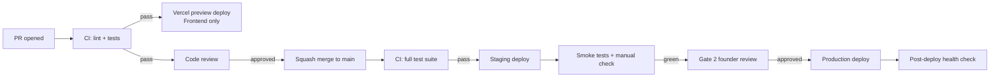

# Deployment Guide

This document is the canonical reference for getting Trading Bridge / TradeTri to production safely. It covers the deploy patterns we use, the Gate 2 review process, and the rollback playbooks. For deep dive on individual environments see [deployment.md](deployment.md) and [deployment-guide.md](deployment-guide.md); this guide is the strategy + process layer.

## Environment layout

| Environment | Backend host | Frontend host | Database | Redis | Purpose |
|---|---|---|---|---|---|
| `local` | localhost (uvicorn) | localhost:3000 | docker postgres | docker redis | Developer machines |
| `preview` | Vercel-spawned ephemeral | Vercel preview | shared staging RDS | shared staging redis | Per-PR preview |
| `staging` | EC2 staging | tradetri-staging.vercel.app | staging RDS | staging ElastiCache | Pre-prod validation |
| `production` | EC2 prod (2-AZ) | tradetri.com | prod RDS (multi-AZ) | prod ElastiCache | Live customers |

Production is the only environment that touches real broker accounts. Staging uses broker sandbox/paper APIs.

## The deploy pipeline



CI runs on every push. Staging deploy is automatic on merge to `main`. Production requires Gate 2 — explicit founder approval.

## Gate 2: the founder review

Gate 2 exists because production changes can affect real customer orders and real money. It's the deliberate brake we keep on.

### What Gate 2 covers

- Any change to backend brokers, kill switch, webhook handlers, or strategy engine.
- Any database migration.
- Any change to environment secrets or infrastructure config.
- Any update to `vercel.ts` / `vercel.json` for the frontend.
- Any dependency upgrade (npm or pip) crossing a minor version boundary.

### What Gate 2 does NOT cover (safe to ship without)

- Content-only changes (FAQs, indicator content, strategy explainers, email/marketing templates).
- Pure documentation changes in `docs/`.
- Frontend cosmetic-only changes (typography, spacing) with no logic changes.
- Test additions that don't change behavior.

### How Gate 2 works

1. PR is reviewed and merged to `main` (CI green).
2. Staging deploy is automatic.
3. Author posts a Gate 2 request: link to staging URL, summary of changes, test plan, rollback plan.
4. Founder reviews on staging — runs the test plan manually.
5. Founder explicitly approves ("Gate 2 approved, ship") or requests changes.
6. Author triggers production deploy from the GitHub Actions UI with a deploy reason.

Never bypass Gate 2 even if you think the change is trivial. The brake is the point.

## Production deploy mechanics

### Backend (EC2)

```bash
# From the deployment server, with prod credentials
./scripts/deploy_prod.sh --tag v1.45.0 --reason "Phase C live trading"
```

The script:

1. SSHs to both EC2 nodes (we run 2-AZ).
2. Pulls the new tag.
3. Runs `alembic upgrade head` (migrations are forward-only).
4. Restarts uvicorn workers (rolling — one node at a time).
5. Runs the post-deploy health check.
6. Fails loudly and refuses to proceed if any step errors.

### Frontend (Vercel)

Production frontend deploys from the `main` branch on push (auto). To gate this off the backend deploy, we use a feature-flag pattern: ship the frontend feature behind a flag, then flip the flag from the admin panel once backend is verified.

```bash
# After backend deploy is healthy:
curl -X POST https://api.tradetri.com/api/admin/feature-flags \
  -H "Authorization: Bearer $ADMIN_JWT" \
  -d '{"flag": "phase_c_live", "enabled": true}'
```

### Database migrations

- All migrations live in `backend/migrations/versions/`.
- Migrations are **forward-only**. We don't run `alembic downgrade` in production.
- Migrations must be backward-compatible with the running code for at least one deploy cycle (so we can roll back the application without rolling back the schema).
- For destructive changes (DROP COLUMN, DROP TABLE), do it in two deploys: first stop reading/writing, then drop in a later release.

## Rollback procedures

### Frontend rollback (5 seconds)

```bash
# Vercel CLI
vercel rollback --previous --project tradetri --token $VERCEL_TOKEN
```

Or via Vercel dashboard — "Promote to Production" on the previous deployment.

### Backend rollback (5 minutes)

```bash
./scripts/deploy_prod.sh --tag <previous_tag> --reason "Rolling back v1.45.0 due to <incident>"
```

The rolling restart pattern means at least one node is always serving during the rollback.

### Database rollback

We don't roll back the schema. If a migration is broken:

1. Stop the application (set maintenance mode flag in admin panel).
2. Apply a forward-fix migration that corrects the issue.
3. Restart the application.

Schema rollbacks via `alembic downgrade` are too risky on a live system with concurrent writes.

### Kill switch (emergency)

If something is dramatically wrong — orders going to wrong accounts, runaway losses — hit the global kill switch:

```bash
curl -X POST https://api.tradetri.com/api/admin/global-kill-switch \
  -H "Authorization: Bearer $ADMIN_JWT" \
  -d '{"enabled": true, "reason": "incident-2026-05-18-broker-routing"}'
```

This blocks all new order placements platform-wide. Existing positions are untouched (they stay with the broker). Use sparingly — every minute the kill switch is active is a minute customers can't trade.

## Monitoring + alerting

| Signal | Tool | Alert threshold |
|---|---|---|
| Backend latency p95 | CloudWatch | > 500 ms for 5 min |
| Backend 5xx rate | CloudWatch | > 0.5% for 5 min |
| Frontend Core Web Vitals | Vercel Analytics | LCP > 2.5s p75 |
| Database connection pool | RDS Performance Insights | > 80% utilization |
| Redis memory | ElastiCache | > 75% |
| Webhook failures | App logs + Sentry | > 10 in 1 min for one webhook |
| Order placement errors | App logs + Sentry | any in production |
| Kill switch triggers | App logs + Sentry | any per-user trigger |

On-call is rotating; current rotation is in the team handbook. Pages go to the on-call's phone via PagerDuty.

## Secrets management

- **AWS Secrets Manager** for backend secrets (DB credentials, encryption keys, JWT signing key, broker API keys for our internal admin accounts).
- **Vercel Environment Variables** for frontend public + private envs.
- Never commit secrets. Pre-commit hooks scan for AWS keys / Slack tokens / common patterns.
- Rotate JWT signing key every 90 days. The rotation is online: old key validates briefly while new key signs.
- Rotate database passwords every 180 days.

## CI/CD specifics

We use GitHub Actions:

- `.github/workflows/ci.yml` — runs on every push and PR.
- `.github/workflows/deploy-prod.yml` — manually triggered with `workflow_dispatch`.
- `.github/workflows/staging-deploy.yml` — automatic on push to `main`.

Workflow runs use OIDC for AWS credentials (no long-lived keys in GitHub Secrets).

## Domain + DNS

- Primary: `tradetri.com` → Cloudflare → Vercel (frontend) + EC2 ALB (api subdomain).
- API: `api.tradetri.com` → ALB → EC2.
- Staging: `tradetri-staging.vercel.app` (Vercel-provided) for FE; `api-staging.tradetri.com` for BE.
- DNS changes go through a 4-eye review — DNS errors are the most painful kind of outage.

## Post-deploy checklist

After every production deploy:

- [ ] `/api/health/detailed` returns all green.
- [ ] Login flow works end-to-end (test account).
- [ ] One paper-mode strategy can be cloned and started.
- [ ] One webhook fires successfully through to a sandboxed broker order.
- [ ] No new errors in Sentry within 10 minutes.
- [ ] CloudWatch latency p95 not regressed vs prior 1h baseline.

Found a regression? Roll back. Don't try to forward-fix during the first hour — fix it on a branch, then re-deploy.

## Where to look next

- [deployment.md](deployment.md) — local + docker setup deep dive
- [deployment-guide.md](deployment-guide.md) — historical context (older runbook)
- [MONDAY_MORNING_RUNBOOK.md](MONDAY_MORNING_RUNBOOK.md) — weekly market-open ops
- [PHASE_C_MONDAY_DEPLOY_RUNBOOK.md](PHASE_C_MONDAY_DEPLOY_RUNBOOK.md) — most recent live-trading deploy
